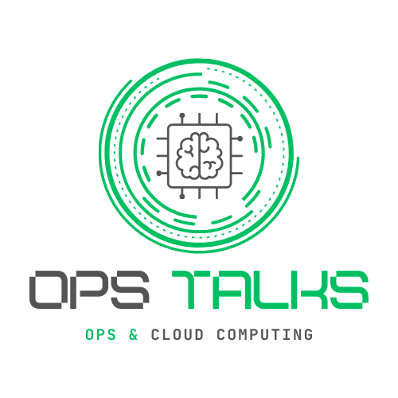

# Ops Talks 🚀

  

  <strong>Sua infraestrutura Cloud com excelência operacional.</strong> 
  Gerenciamento de infraestrutura, consultoria DevOps e automação. Construímos e mantemos ambientes escaláveis, seguros e resilientes para o seu negócio.

  
  
  
  

---

## 🛠️ O que fazemos

Oferecemos soluções completas para toda a jornada Cloud, da concepção à operação:

- **☁️ Cloud Infrastructure**: Provisionamento e gerenciamento (AWS & GCP) com foco em segurança e custos.
- **🚀 CI/CD & Automação**: Pipelines eficientes com GitHub Actions, Jenkins e ArgoCD.
- **☸️ Kubernetes & Containers**: Orquestração escalável (EKS, GKE) e gestão de clusters.
- **📜 IaC (Infra as Code)**: Terragrunt e Terraform/OpenTofu para infraestrutura modular e versionada.
- **🛡️ SRE & Observabilidade**: Monitoramento proativo (Datadog, Prometheus, Grafana) e cultura de SLOs.
- **🎓 Consultoria & Mentoria**: Evolução cultural DevOps e planejamento estratégico de nuvem.

---

## 🌟 Projetos em Destaque (Open Source)

Contribuímos ativamente com a comunidade através de ferramentas e módulos:

### Terragrunt Tools

- **[Cultivator](https://github.com/Ops-Talks/cultivator)**: CI/CD para orquestração de Terragrunt
- **[Agronomist](https://github.com/Ops-Talks/agronomist)**: Ferramenta para manter sua IaC sempre atualizada
- **[tgenv](https://github.com/tgenv/tgenv)**: Gerenciador de versões do Terragrunt.

### OpenTofu/Terraform Modules

- **[terraform-aws-modules](https://github.com/weyderfs/terraform-aws-modules)**: Módulos opinativos para AWS.
- **[terraform-db-modules](https://github.com/weyderfs/terraform-db-modules)**: Automação de bancos de dados.
- **[terraform-datadog-modules](https://github.com/weyderfs/terraform-datadog-modules)**: Módulos para observabilidade.

---

### 👨‍💻 Liderança

**Weyder Ferreira**  
*Founder & Principal SRE*

Com mais de 18 anos de experiência em infraestrutura, Weyder lidera a Ops Talks com foco em SRE, Kubernetes e cultura DevOps. Com passagens por empresas como PicPay, Nuvemshop e Serasa, traz a expertise necessária para escalar operações complexas.

> **[LinkedIn Profile](https://linkedin.com/in/weyderfs)**

---

  Conecte-se conosco e vamos transformar sua infraestrutura! 🚀 
  📧 <a href="mailto:weyderfs@gmail.com">contato@opstalks.com.br</a> • 📝 <a href="https://opstalksit.substack.com/">Substack</a>

